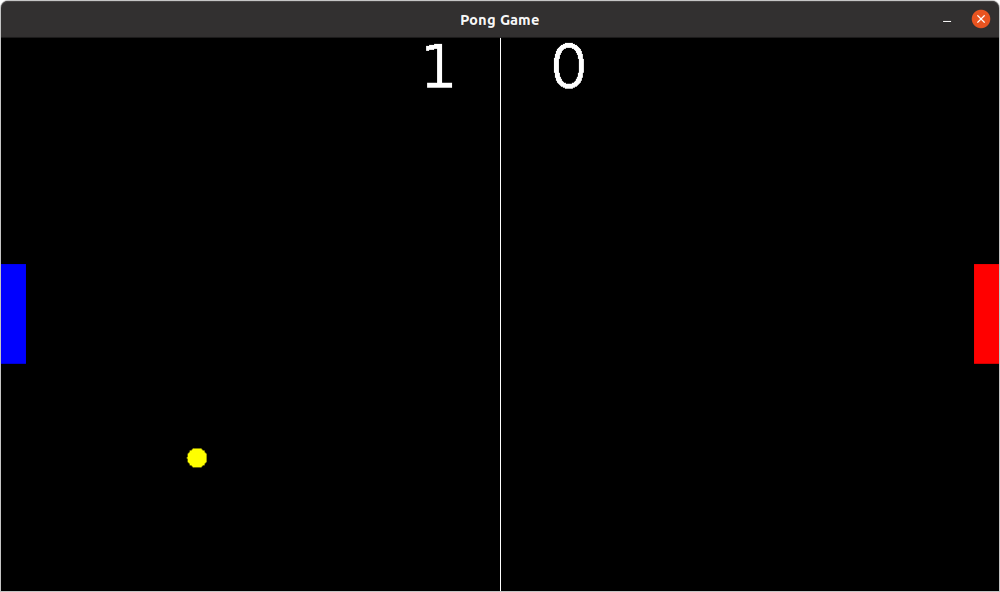

<h1 align="center">Pong - Java Game</h1>

---

 Trata-se de releitura do clássico PONG GAME feito utilizando ferramentas JAVA.
      

## 📝 Sumário

- [Sobre](#sobre)
- [Uso](#uso)
- [Contribuições](#contribuicoes)
- [Autor](#autor)
- [Conhecimentos](#conhecimentos)

## :) Sobre 

O Jogo "Pong" foi o primeiro a ser lucrativo na história da indústria de jogos. Criado por Nolan Bushnell e Ted Dabney foi recriado e adpatado por diversas vezes. 

O **Pong - Java Game** é uma implementação java que busca recriar a nostálgica sensação do jogo pong. 

## 🎈 Uso 

Para jogar 
1. Player 1 : utilize as teclas "W" para movimentar a raquete para cima e "S" para movimentar a raquete para baixo. 
2. Player 1 : utilize as teclas "ARROW UP" para movimentar a raquete para cima e "ARROW DOWN" para movimentar a raquete para baixo.

## ✍️ Autor 

- [@Rodrigovvo](https://github.com/Rodrigovvo) 

## 🎉 Conhecimentos 
Foi utilizado [JAVA](https://www.java.com/pt-BR/) com a interface gráfica Swing.

- Inspiração && Referências:
    [Bro Code](https://www.youtube.com/watch?v=oLirZqJFKPE&t=1167s)
